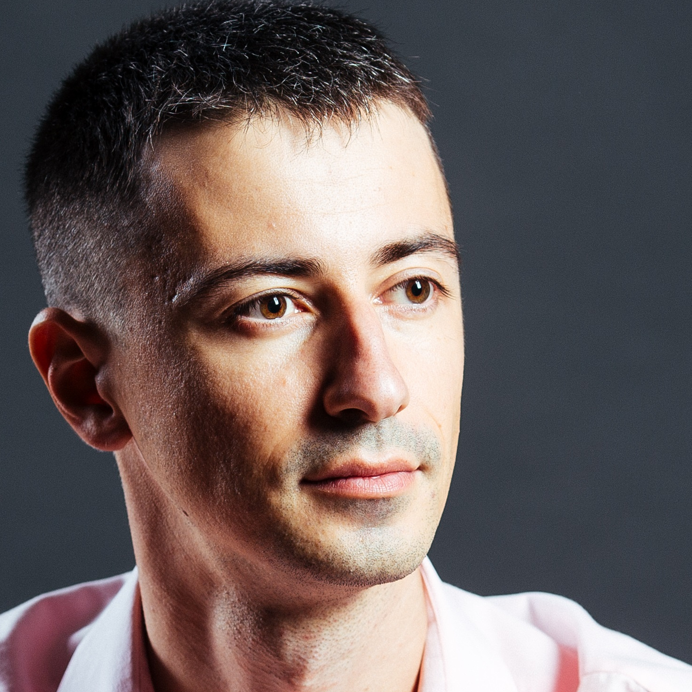

# KIRILL KOVALCHUK

## CONTACTS

Feel free to contact me via Telegram @kirill_kovalchuk or by scanning this QR code:

## TESTIMONIAL

Possess highly developed leadership and organizational qualities. Ability to assess situations and make clear and concise decisions based on facts. Well-practiced analytical skills. Goal oriented. Resourceful, adaptable, enjoy challenges. Deep understanding of technical architectures and products.

## CAREER HISTORY

- 2016 to today, Individual Entrepreneur, Product manager, Project manager, Solution designer, Several dev teams behind up to 25 employees in total.
- 2013, [Mobilkassan](http://www.mobilkassan.se/), Product manager, Solution designer, Full stack (web, mobile, java)
- 2007, [Fastdev AB](http://fastdev.se/), Founder of Russian development department, CTO, grew from 0 up to 30 employees.
- 2006, [HTC Ltd](http://htc-cs.com/), Chief of Java department, Project manager, J2SE stack, 2 big projects, 5 employees.
- 2003, [Inmarsoft Ltd](http://inmarsoft.com/), Project manager, Full stack (c++, php, python, java, .NET), 20 successful projects, 30 employees.
- 2001, [NPO Computer Ltd](http://www.npo-comp.ru/), Software developer, Delphi 
- 2000, Volgogeologia FGUP, Software developer, Delphi
- 1999-2004, education, [Izhevsk State Technical University](http://inter.istu.ru/), Informatics and Computer Engineering, Software engineer, military training: lieutenant in mobile communication facilities

## ABOUT

- Coding. Coding is my passion. Coding is always a challenge: make it better, more stable, bug free. And enjoy the result. Enjoying thankful users. Enjoying optimal KPI on monitoring.
- Goals. Make them SMART. Reaching goals gives me power. GTD is my way to reach goals.
- Inspiration. My family, friends, social relationships and warm-n-cool social climate keep me motivated. Good team is the key to success.
- Skills. Java (8 years): Up to Java8, collections, concurrency, streams, netty/NIO, Spring (Boot, Data in theory), JPA, Kotlin in theory, JMS. 4 years of code review. Teaching newbies. Python (6 years): Django (many applications), xlrd, PIL, gettext, lxml, OAuth etc. Databases (9 years): Oracle, Azure SQL, MySQL, PostgreSQL, MongoDB basics. Web (9 years): HTML/CSS <2.0, LESS/SASS, CSSJS, ES6, React/Redux in theory, code review. Teaching newbies. Handlebars, Webpack, Typescript basics. .NET (3 years): C#, ASP.NET, .NET Core. Infrastructure: ELK, Zabbix, Prometheus, k8s user. Zuul in theory, Spring cloud in theory. Gitlab CI, Jenkins, GIT, Application Insights, Sentry, Bash, Docker, nginx, Terraform basics. Architecture: CAP, microservices, ESB, idempotency, CDN, MVVM, HcLc, circuit breaker, OCP, IoC.
